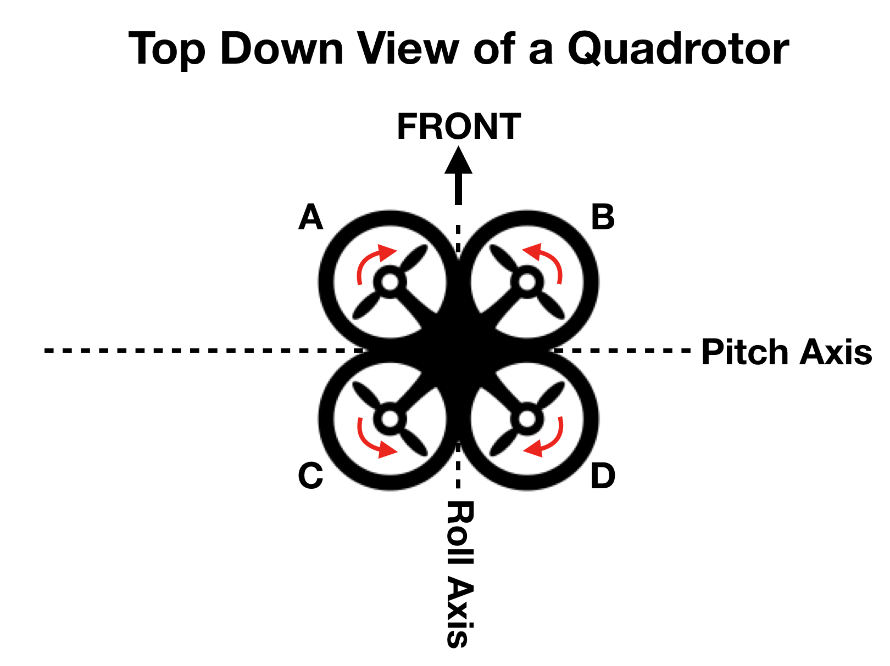
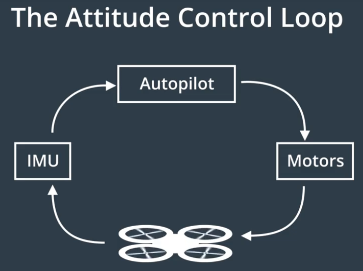
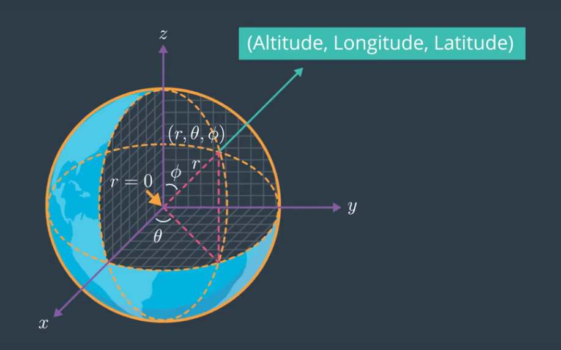
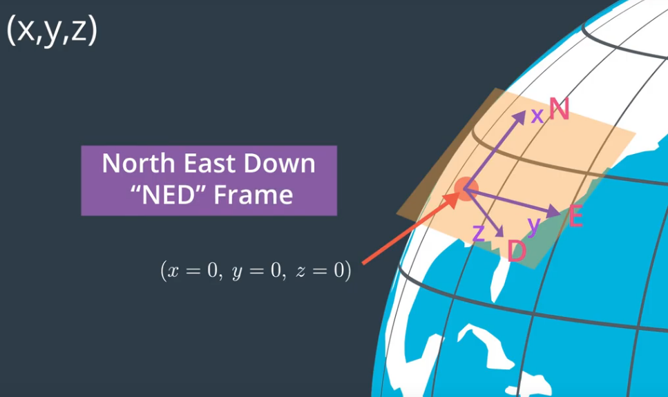
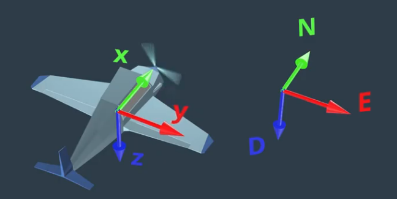
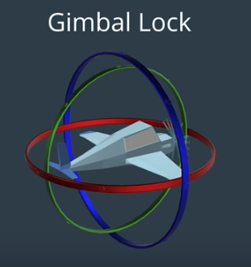
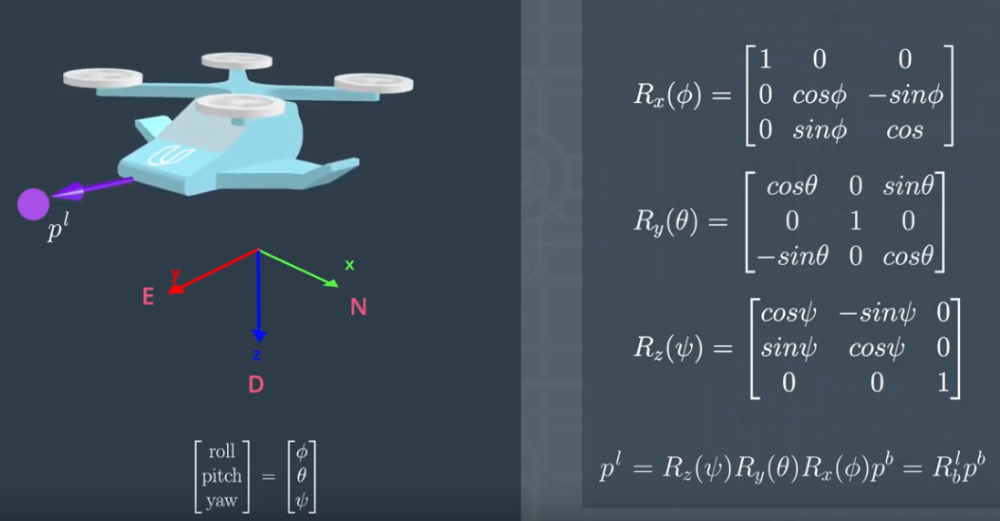

# autonomous-drone   

Notes and resources for autonomous drones     

## Quadrotor Components
___
- frame 
- four propellers
    - tractor - pulls air downward 
    - 2 counter clockwise and 2 clockwise to allow for zero net torque
    - thrust depends on how fast motors are spinning and pitch
    - pitch of the propeller - blades are twisted out, not flat, and cause prop to move forward
    - pitch is the linear distance the propeller would move forward in one rotation
    - large pitch props move more air per revolution and are more efficient but have lower thrust so not good for hovering a heavy vehicle
- electric motors to drive each propeller
    - Kv rating - RPMs the motor will achieve under zero load when a given voltage is applied
    - Kv = RPMs/volts
    - motors opposite each other spin in same direction
    - the two pairs of motors spin on opposite directions 
    - when spinning at the same speed the drone can hover with a net torque of 0
    - consume over 99% of battery power
    - to move (drive) drone induce more thrust on adjacent motors spinning in opposite directions
- electronic speed controller (ESC) for each motor
    - receives RPM signal from autopilot and oscillates magnetic field to spin the motor
- autopilot to decide what the motors should do (attitude control) (lower level control)
- flight computer: higher level functions like what the drone should do next - flight control - brain
- sensors like GPS, inertial measurement unit (IMU), camera
- IMU
    - typically three gyroscopes and three accelerometers
- battery for power

   

Attitude Control 
- Pitch: how much the drone is tilted forward or backward
- Roll: how much the drone is tilted left or right
- Yaw: how much the drone is turned about the vertical axis
- Euler angles
- Combination of torque from all four rotors acts like a vector that follows the attitude of the drone 
- Need to spin each rotor faster or slower to aim the thrust vector in a certain direction
- Make the drone go faster by increasing the magnitude and angle of the thrust vector

      

      

## Planning Problem
___
- Search Space
    - Grid representation
- All possible states
- Start state
- Goal state
- Actions
- Cost
    - G = cost function
    - H = Heuristic function - underestimate of remaining cost 
    - F = G + H (estimate of total cost)
    - Triangle inequality theorem
    - Admissable and Consistent
    - 
- Plan is a sequence of state from start state to goal state
- Partial plan
- Breadth-First search - finds shortest path to goal
- Depth-First search
- A*

## Representations
___
- Geodetic Frame
    - Altitiude, Longitude (east/west), Latitude (north/south)
    - r = 0 at origin
    - Altitude = 0 at surface of the earth
    - Latitude and Longitude define position on spherical surface
    -    
- ECEF Frame
    - Earth Centered Earth Fixed
    - Every point is represented by x,y,z
    - NED Frame - z points down
    -   
- Body Frame
    - Euler angles
    - Roll, Pitch, Yaw
    - counter clockwise
    -   
    - Gimbal Lock
    - order matters
    - roll, pitch, yaw
    -  
    - Rotation Matrices
    -  
    - Quanternion
    - 
- Configuration Space
    - Dimensionality = degrees of freedom
    - Drone typically has 6 - (x, y, z) and (roll, pitch, yaw)
    